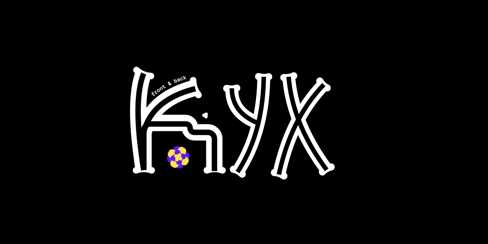
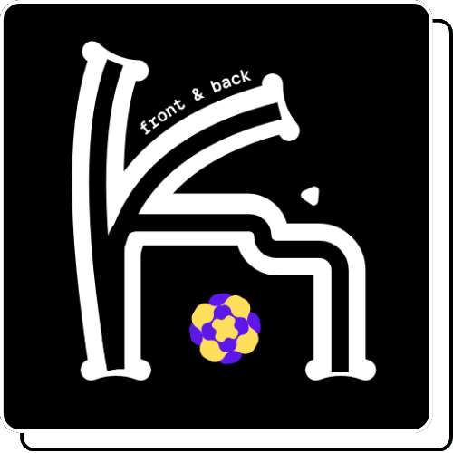

<!-- minimal black & white profile -->

  

 

<table width="100%" cellpadding="0" cellspacing="0">
<tr>

<td width="55%" align="left" valign="middle">

<b>about</b>  

Python developer focused on automation, backend and efficiency.  

I use Linux as my main system and treat the CLI as a core part of my workflow. 
Everything I build aims to be simple, fast and practical.

</td>

<td width="45%" align="center" valign="middle">

</td>

</tr>
</table>

 

  

